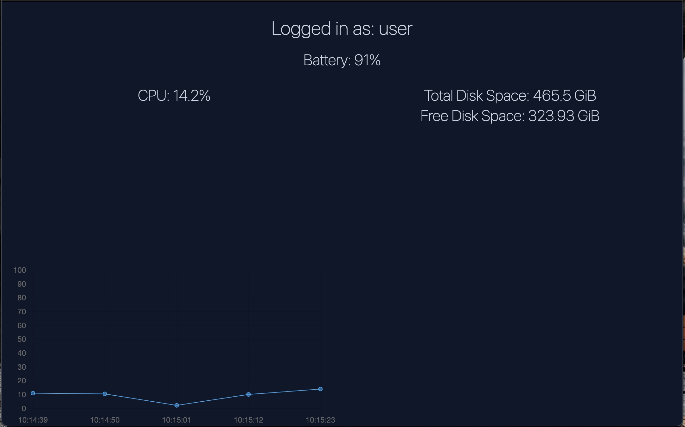

## About the Project

This is a simple system monitor app.

There are more features coming in the future.

## Built With

## Prerequisites

* npm
* node
* python3

## Installation

1. Clone the repository 
2. npm install
3. create an env file with an env variable representing absolute path from the root of your device to the cpu_usage.txt file
4. at the root of the project create a python virtual environment explicity called .venv
5. npm run start

## Usage

Simply run the command npm run start from your terminal to open the app and enjoy use of this system monitor app

